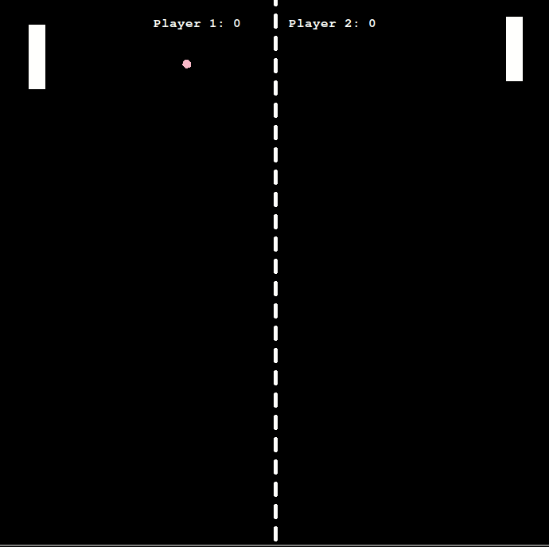
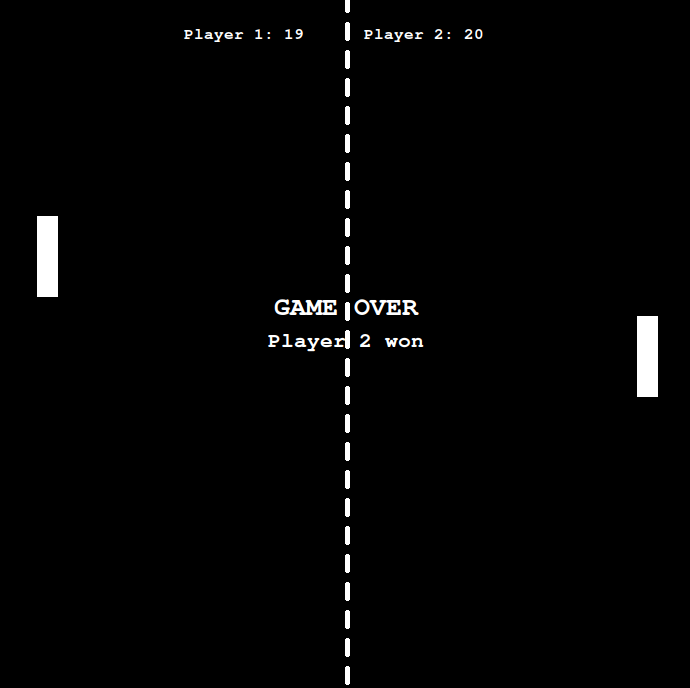
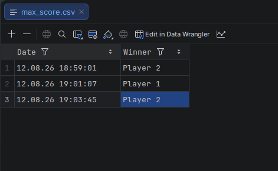

# 🏓 Pong Game

A two-player Pong game built with Python and Turtle Graphics.



## ✨ Features

- Two-player Pong gameplay
- Rectangular paddles
- Ball and paddle collision detection
- Wall bouncing
- Score tracking
- Winner detection
- Game-over screen
- Saving the winner and date/time to a CSV file
- Modular object-oriented project structure

## 🎮 Controls

| Player | Move Up | Move Down |
|---|---|---|
| Player 1 | `W` | `S` |
| Player 2 | `↑` | `↓` |

## 🏁 Game Over

When a player reaches **20 points**, the game ends and the winner is displayed.



## 📊 Score History

Each completed game is recorded in `max_score.csv` with the date, time, and winning player.



## 🚀 How to Run

Make sure Python and Turtle are installed.

```bash
python main.py
```

On Ubuntu, if Turtle is unavailable:

```bash
sudo apt install python3-tk
```

## 📁 Project Structure

```text
pong_game/
├── main.py
├── ball.py
├── paddle.py
├── border.py
├── scoreboard.py
├── max_score.csv
├── assets/
│   ├── gameplay.gif
│   ├── game_over.png
│   └── score_history.png
├── README.md
└── .gitignore
```

## 🧠 What I Practiced

- Python OOP
- Classes and inheritance
- Turtle Graphics
- Keyboard event handling
- Collision detection
- Game loops
- CSV file handling
- Modular project structure
